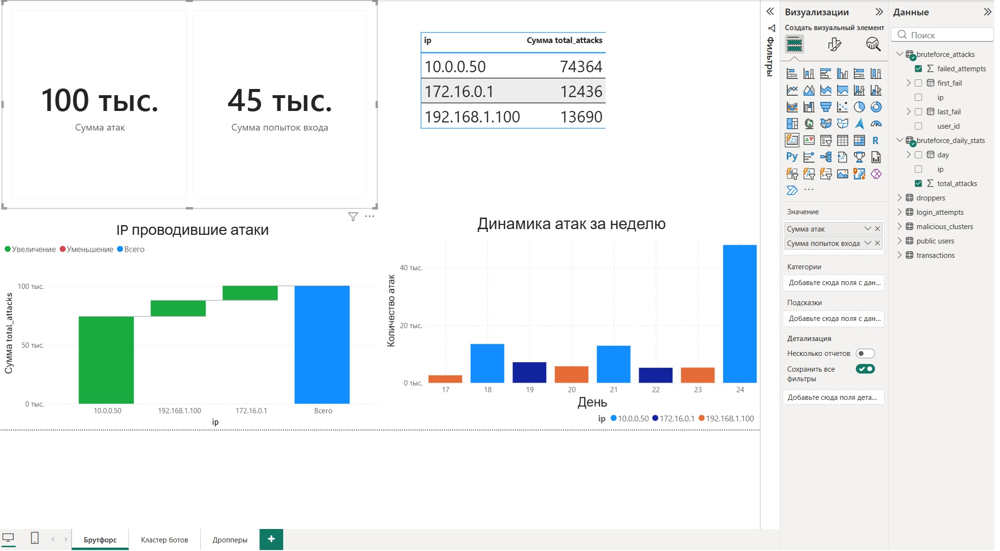
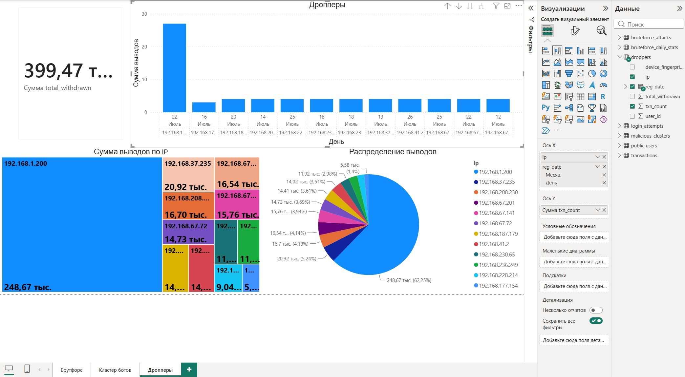

# Fraud-sql-portfolio

## Антифрод-дашборд (Power BI + PostgreSQL)

Дашборд для мониторинга аномалий:
- Кластеры ботов
- Брутфорс-атаки
- Дропперы (вывод без логина)

---

## 📁 Файлы в репозитории

- `dashboard.pbix` — файл дашборда Power BI
- `/sql/` — SQL-скрипты для создания таблиц, представлений и вставки данных
- `/screenshots/` — скриншоты дашборда
- `generate_data.py` — скрипт для генерации тестовых данных

---

## 🖼️ Скриншоты

### Брутфорс

### Дропперы

### Кластеры ботов

---

## 🛠️ Технологии

- PostgreSQL (Docker)
- Power BI Desktop
- SQL (CTE, оконные функции, агрегации)
- Python (генерация данных)

---

## 🚀 Как запустить

1. Поднять PostgreSQL в Docker:
docker run --name antifrod_db -e POSTGRES_PASSWORD=123456 -e POSTGRES_DB=antifrod -p 5432:5432 -d postgres:15

2. Выполнить SQL-скрипты из папки `/sql/` в DBeaver или через `psql`.

3. Открыть файл `dashboard.pbix` в Power BI Desktop.

4. Настроить подключение к БД:
   - ODBC → `localhost` → `antifrod` → `postgres` / `123456`

5. Нажать кнопку **«Обновить»**.

---

## 📬 Контакты

Telegram: @HGK40
